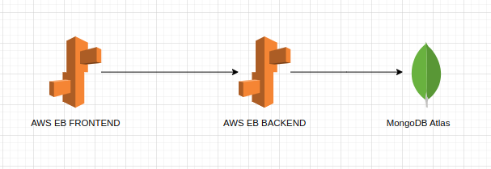

Script Manager

# Architecture

# Tech Stack

|               | Frontend   | Backend       | Database       |
|---------------|------------|---------------|----------------|
| **Framework** | React      | Express.js    | MongoDB        |
| **Hosting**   | AWS S3     | AWS EB or ECS      | MongoDB Atlas  |
| **Language**  | TypeScript | TypeScript    | NoSQL          |

# RESTful API Endpoints

| HTTP Method | Endpoint           | Description               |
|-------------|---------------------|---------------------------|
| `POST`      | `/scripts`          | Create a new script       |
| `GET`       | `/scripts`          | Retrieve all scripts      |
| `GET`       | `/scripts/:id`      | Retrieve a specific script|
| `PUT`       | `/scripts/:id`      | Update an existing script |
| `DELETE`    | `/scripts/:id`      | Delete a specific script  |

# Suggested Deployment Architechture

Docker Image -> CodeBuild -> Elastic Container Registry -> CodeDeploy -> Elastic Container Service

Docker Image -> Elastic Beanstalk 

# Branching strategy
Feature Branching
