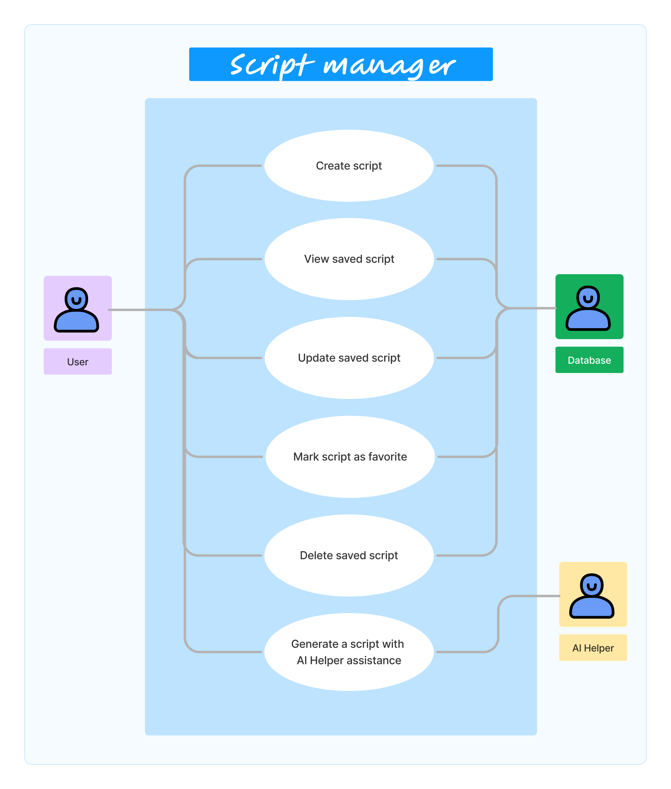

# Script Manager

    - Project Members: Aleksei Beliaev, Anam Sadiq, Deniz Kartal, Erdenezul Batmunkh, Marina Valcanaia
## How to Install and Run the Project

Before you start:

- Make sure Node.js is installed running the following command:
```
node --version
```

- Make sure npm is installed running the following command:
```
npm --version
```
If needed, follow the official documentation [here](https://nodejs.org/en/learn/getting-started/how-to-install-nodejs) to install both Node.js and npm.

- Make sure to set up git in your local machine, the official documentation can be found [here](https://docs.github.com/en/get-started/getting-started-with-git/set-up-git).

- Clone this repository

### Backend
- Create a test mongodb database on your local machine
- Create '.env' file inside the backend folder with the command:
```
  touch .env
 ```

Add the following credential to the created file 
```
MONGO_DB_URI=<your local URI goes here>
NODE_ENV=development
PORT=5000
```

- Open a terminal and navigate to the backend folder:
```
cd backend/
```

- Run the following commands:

```
npm install 
```

```
npm run dev
```

The backend should start running in the following URL: [http://localhost:5000](http://localhost:5000)

### Frontend

- Open a terminal and navigate to the frontend folder:
```
cd frontend/
```

- Run the following commands:
```
npm install 
```

```
npm run dev
```

The frontend should start running in the following URL: [http://localhost:5173/](http://localhost:5173/)


## Architecture


## Tech Stack

|               | Frontend   | Backend       | Database      |
| ------------- | ---------- | ------------- | ------------- |
| **Framework** | React      | Express.js    | MongoDB       |
| **Hosting**   | AWS S3     | AWS EB or ECS | MongoDB Atlas |
| **Language**  | TypeScript | TypeScript    | NoSQL         |

## RESTful API Endpoints

| HTTP Method | Endpoint           | Description                  |
| ----------- |--------------------| -----------------------------|
| `POST`      | `/api/scripts`     | Create a new script          |
| `GET`       | `/api/scripts`     | Retrieve all scripts         |
| `GET`       | `/api/scripts/:id` | Retrieve a specific script   |
| `PUT`       | `/api/scripts/:id` | Update an existing script    |
| `DELETE`    | `/api/scripts/:id` | Delete a specific script(s)  |


## External Systems

- openai (TODO: some info here)

## Deployment

    suggestions:
    Docker Image -> CodeBuild -> Elastic Container Registry -> CodeDeploy -> Elastic Container Service

    Docker Image -> Elastic Beanstalk

## Branching Strategy

- Feature Branching

## Repository Strategy

- Mono-Repo approach - single repo for frontend & backend

## Use Cases

1. The user opens the application and writes a script using the code editor, the script is saved to a database.
2. The user can view saved scripts.
3. The saved scripts can be updated as needed.
4. The user can delete a script when it is no longer needed.
5. The user can create scripts with assistance of AI Helper.



